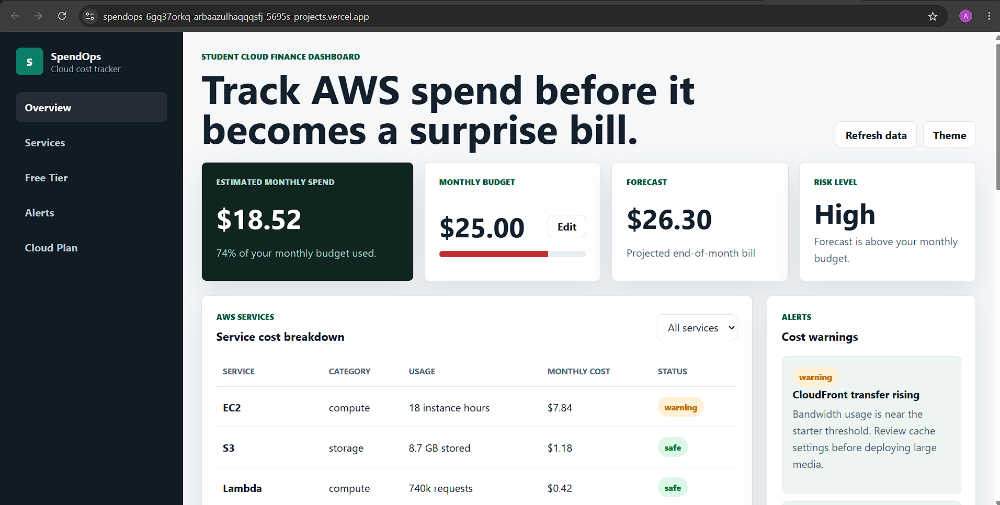

# SpendOps - Cloud Cost Tracker

[Live Demo](https://spendops-dun.vercel.app) | [Backend Architecture](./ARCHITECTURE.md) | [Deployment Checklist](./DEPLOYMENT-CHECKLIST.md)

SpendOps is a student-focused cloud cost dashboard for understanding AWS
spending, service usage, budget risk, and Free Tier consumption. It began as a
frontend MVP and is being developed into a serverless AWS application.



## Project Status

**Current stage:** Frontend deployed, serverless backend prepared locally, AWS
deployment in progress.

The live dashboard currently displays clearly defined demonstration data. It
does not yet connect to a real AWS billing account. This distinction keeps the
project technically honest while the secure AWS integration is developed.

## Features

- Monthly cloud-spend summary
- Editable monthly budget stored in LocalStorage
- End-of-month cost forecast
- Budget risk indicator
- AWS service cost breakdown and filtering
- Free Tier usage meters
- Cost warnings and optimisation recommendations
- Light and dark themes
- Responsive dashboard layout
- Local serverless API prototype
- Automated Lambda response test
- OpenAPI contract and AWS SAM infrastructure template

## Tech Stack

### Frontend

- HTML
- CSS
- JavaScript
- LocalStorage
- Vercel

### Serverless Backend

- AWS Lambda
- Amazon API Gateway
- Amazon DynamoDB
- AWS CloudWatch
- AWS SAM / CloudFormation
- Node.js
- OpenAPI

### Planned AWS Hosting

- Private Amazon S3 bucket
- Amazon CloudFront
- CloudFront Origin Access Control

## Architecture

```text
Browser
  |
  +--> CloudFront --> Private S3 frontend
  |
  +--> API Gateway --> Lambda --> DynamoDB
                            |
                            +--> CloudWatch logs and metrics

AWS Budgets --> account-level cost notifications
```

The frontend never contains AWS credentials. API Gateway provides the HTTPS
interface, Lambda handles application logic, and DynamoDB stores daily cost
snapshots. CloudWatch provides backend observability.

## Repository Structure

```text
.
|-- index.html
|-- styles.css
|-- script.js
|-- spendops-dashboard.png
|-- README.md
`-- backend
    |-- lambda
    |   |-- index.mjs
    |   |-- index.test.mjs
    |   `-- package.json
    |-- sample-data
    |   `-- dynamodb-items.json
    |-- ARCHITECTURE.md
    |-- DEPLOYMENT-CHECKLIST.md
    |-- local-server.mjs
    |-- openapi.yaml
    `-- template.yaml
```

## Run the Frontend

Clone the repository:

```bash
git clone https://github.com/arbaazulhaqqqsfj-web/spendops-cloud-cost-tracker.git
cd spendops-cloud-cost-tracker
```

Open `index.html` in a browser or run it using the VS Code Live Server
extension.

## Run the API Locally

```bash
cd backend
node local-server.mjs
```

Open:

```text
http://127.0.0.1:3000/costs
```

Run the automated test:

```bash
cd backend/lambda
node --test
```

## Cloud Roadmap

- [x] Build the frontend dashboard
- [x] Deploy the frontend on Vercel
- [x] Add AWS account MFA and cost-budget protection
- [x] Prepare a Lambda API and automated test
- [x] Define API Gateway and DynamoDB using AWS SAM
- [x] Document the API using OpenAPI
- [ ] Host the frontend using private S3 and CloudFront
- [ ] Deploy API Gateway, Lambda, and DynamoDB
- [ ] Connect the frontend to the deployed API
- [ ] Add CloudWatch alarms and operational monitoring
- [ ] Replace demonstration data with secure AWS Cost Explorer data
- [ ] Add CI/CD using GitHub Actions

## Data and Pricing Disclaimer

The current dashboard values are demonstration data. They are not live AWS
prices or charges. Actual AWS costs depend on region, usage, account settings,
Free Tier eligibility, data transfer, taxes, and current AWS pricing.

Real billing data will only be accessed through a secure backend. AWS access
keys will never be placed in browser JavaScript or committed to this
repository.

## What This Project Demonstrates

- Serverless application architecture
- Cloud security and separation of frontend credentials
- Cost awareness and FinOps fundamentals
- REST API and JSON design
- NoSQL data modelling
- Infrastructure as Code
- Testing and deployment planning
- Clear communication of current limitations

## Author

**Arbaaz Ul Haq**  
Second-year Computer Science student in London, building practical cloud and
serverless engineering experience.
